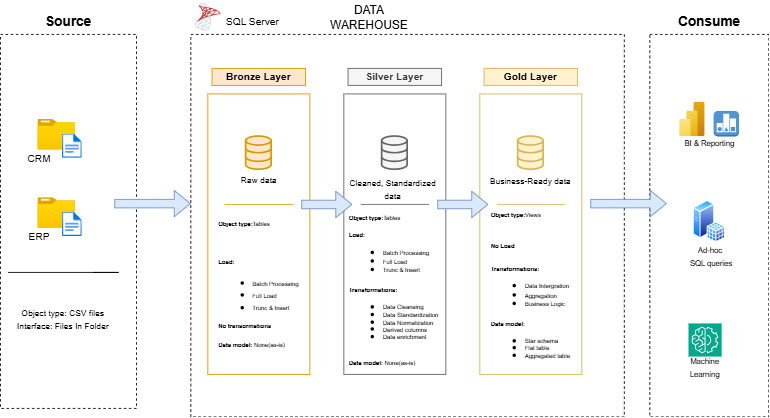
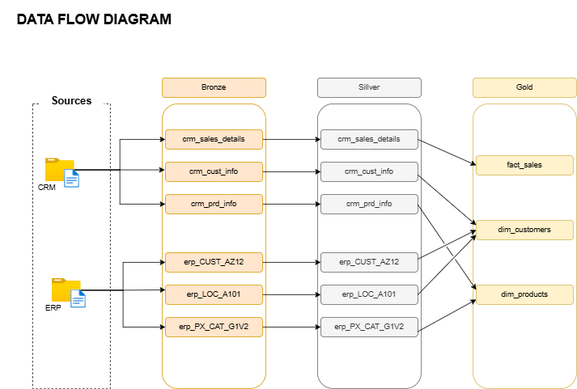
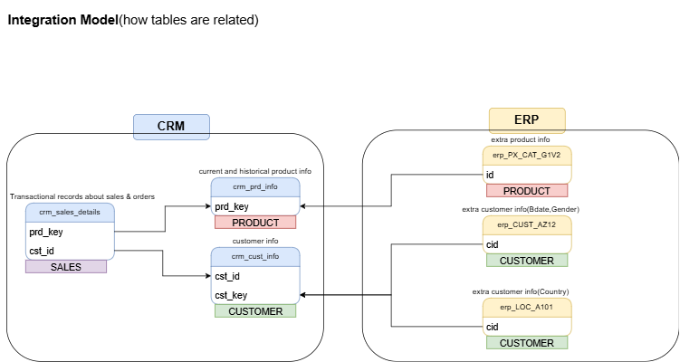
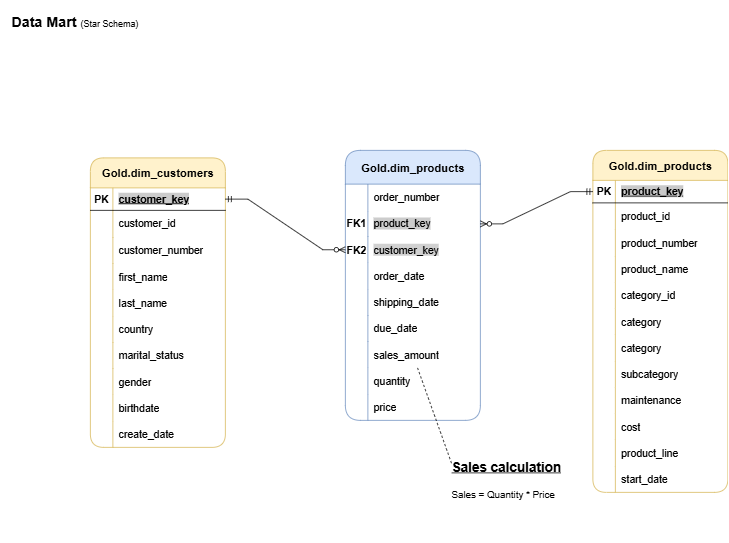

# 🏭 Mosa Data Warehouse

Welcome to my **Data Warehouse and Analytics Project** repository! 🚀
This project demonstrates a comprehensive data warehousing and analytics solution, from building a data warehouse to generating actionable insights. Designed as a portfolio project, it highlights industry best practices in data engineering and analytics.

---

## 🏗️ Data Architecture

The project follows the **Medallion Architecture** with Bronze, Silver, and Gold layers:



1. **Bronze Layer**: Stores raw, unprocessed data ingested directly from source CRM and ERP CSV files.
2. **Silver Layer**: Cleanses, standardizes, and resolves data quality issues from the Bronze layer.
3. **Gold Layer**: Houses business-ready, analytics-friendly views modeled in a star schema for reporting.

<details>
<summary>📊 Additional diagrams (Data Flow, Integration, Model)</summary>

**Data Flow**


**Data Integration**


**Data Model (Star Schema)**


</details>

---

## 📂 Repository Structure
```
mosa-warehouse/
│
├── datasets/                # Raw CRM and ERP source CSV files
│   ├── crm/
│   └── erp/
│
├── docs/                    # Architecture diagrams and data catalog
│   ├── data_architecture.png
│   ├── data_flow.png
│   ├── data_integration.png
│   ├── data_model.png
│   └── data_catalog.md
│
├── scripts/                  # SQL scripts for ETL and transformations
│   ├── init_database.sql     # Creates database and schemas
│   ├── bronze/                # Raw layer DDL and load procedures
│   ├── silver/                # Cleansed layer DDL and load procedures
│   └── gold/                  # Business-ready views (star schema)
│
├── tests/                    # Data quality validation scripts
│
├── LICENSE
└── README.md
```
---

## 🚀 Getting Started

1. Run `scripts/init_database.sql` to create the `DataWarehouse` database and the bronze/silver/gold schemas.
2. Run the scripts in `scripts/bronze/` to load raw CRM and ERP data from `datasets/`.
3. Run the scripts in `scripts/silver/` to cleanse and standardize the bronze data.
4. Run the scripts in `scripts/gold/` to build the final business-ready views.
5. Run the scripts in `tests/` to validate data quality across all layers.

> 📖 See [docs/data_catalog.md](docs/data_catalog.md) for full column-level documentation of the Gold layer.

---

## 🚀 Project Requirements

### Building the Data Warehouse (Data Engineering)

#### Objective
Develop a modern data warehouse using SQL Server to consolidate sales data, enabling analytical reporting and informed decision-making.

#### Specifications
- **Data Sources**: Import data from two source systems (ERP and CRM) provided as CSV files.
- **Data Quality**: Cleanse and resolve data quality issues prior to analysis.
- **Integration**: Combine both sources into a single, user-friendly data model designed for analytical queries.
- **Scope**: Focus on the latest dataset only; historization of data is not required.
- **Documentation**: Provide clear documentation of the data model to support both business stakeholders and analytics teams.

---

### BI: Analytics & Reporting (Data Analytics)

#### Objective
Develop SQL-based analytics to deliver detailed insights into:
- **Customer Behavior**
- **Product Performance**
- **Sales Trends**

These insights empower stakeholders with key business metrics, enabling strategic decision-making.

---

## 🛠️ Tools & Technologies

- **SQL Server** — data warehouse engine
- **T-SQL** — ETL scripts, stored procedures, and views
- **draw.io** — architecture and data model diagrams

---

## 🛡️ License

This project is licensed under the [MIT License](LICENSE). You are free to use, modify, and share this project with proper attribution.

## About Me
Hi there, I'm Mohamed Habib, a young programming enthusiast trying to make something of their life, InshaAllah I will succeed✌️.

### Connect with me
[](https://substack.com/@moha0ll)
